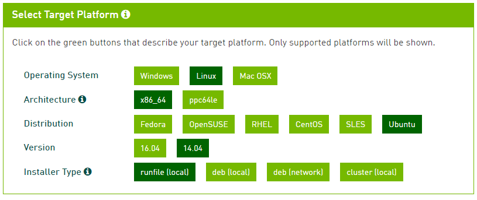

## UbuntuでGPUを利用したディープラーニング環境整備 (2017-March-10)
### 環境
 - OS: Ubuntu 14.04 LTS 64 bit
 - GPU: Nvidia GeForce GTX Titan Black (6 Gb)
 - [GeForce GTX TITAN Black](http://www.nvidia.co.jp/object/geforce-gtx-titan-black-jp.html)

### 手順のまとめ
1. Ubuntuの準備
2. noubeau（ディスプレイドライバ）の削除
3. CUDA 8.0のインストール
4. cuDNNのインストール
5. Anacondaのインストール
6. Pythonで必要なLibraryのインストール
7. MNISTデータセットの取得

### 手順の詳細
1. Ubuntuの準備

  1-1. Ubuntuのダウンロード
  
  - [Ubuntu download](http://releases.ubuntu.com/14.04/)
  - [Ubuntu download mirror](https://mirror.umd.edu/ubuntu-iso/14.04/)

  1-2. Ubuntuインストール <<詳細は割愛。下記に各種ツール。>>
  - USBでインストール
    - [UNetbootin](https://unetbootin.github.io/)
    - [Linux Live](https://www.linuxliveusb.com/)

   - DVDでインストール
     - [ImgBurn](http://www.imgburn.com/)

2. noubeauの削除
  - /etc/modprobe.d/blacklist-nouveau.conf
  
  ```bash
  blacklist nouveau
  blacklist lbm-nouveau
  options nouveau modeset=0
  alias nouveau off
  alias lbm-nouveau off
  ```
 - /etc/modprobe.d/nouveau-kms.conf
 
  ```bash
  options nouveau modeset=0
  ```
  
 - terminal内で下記を実行
 
  ```bash
  sudo update-initramfs -u
  sudo reboot
  ```


3. CUDA 8.0のインストール

  3-1. ダウンロード
    - [CUDA](https://developer.nvidia.com/cuda-downloads)
    
    
  3-2. インストール
    - Terminal内で下記を実行
    
    ```bash
    sudo sh cuda_8.0.61_375.26_linux.run
    ```

4. cuDNNのインストール

  4-1. cuDNNのダウンロード
    - [cuDNN](https://developer.nvidia.com/cudnn)


5. Anacondaのインストール

  5-1. インストール（手動）
    - Terminal内で下記を実行
   
    ```bash
    wget https://repo.continuum.io/archive/Anaconda3-4.3.0-Linux-x86_64.sh
    bash ./Anaconda3-4.3.0-Linux-x86_64.sh
    source ~/.bashrc
    ```

  5-2. Makefileからのインストール（自動）
    - Terminal内で下記を実行

    ```bash
    make install
    ```

6. Pythonで必要なLibraryのインストール

  6-1. インストール（手動）
  
    - Terminal内で下記を実行

    ```bash
    pip install keras
    pip install tensorflow
    pip install tensorflow-gpu
    ```

  6-2. Makefileからのインストール（自動）

    - Terminal内で下記を実行

    ```bash
    make pip
    ```
    
    
7. MNISTデータセットの取得

  7-1. 手動で取得
   - [Mnist](https://github.com/fchollet/keras)

  7-2.

    ```bash
    git clone https://github.com/fchollet/keras
    ```


  7-3. 

    ```bash
    make git
    ```


#### 参考リンク
 - [Using GPU based on Theano and Keras](https://guozhilingblog.wordpress.com/2016/05/19/using-gpu-based-on-theano-and-keras/)
 - [noubeau → cuda](http://qiita.com/shinya_ohtani/items/f374ed0dd51737087369)


